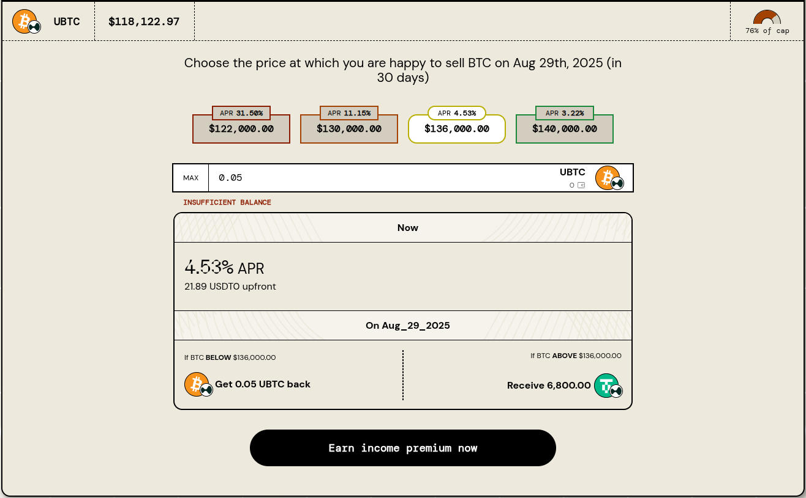
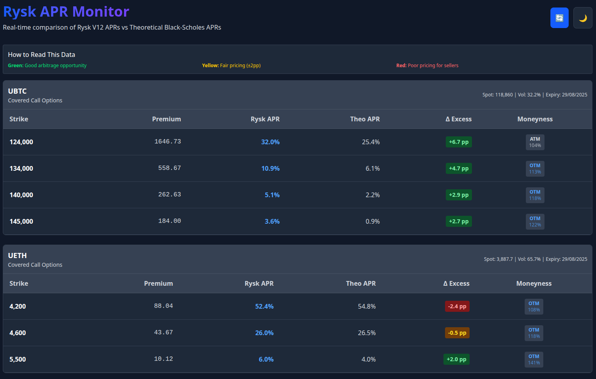

# Reverse Engineering a Covered Calls DeFi App

I recently came across a DeFi project called Rysk Finance. I thought the product sounded interesting so I decided to take a closer look. Their product offers a way to earn income on crypto assets such that the financial risk seems fairly low.

One issue I had is that the pricing of the products wasn't entirely clear to me. I wanted to know if the premia paid justified the risk taken. So I decided to start a chat with o3 inside ChatGPT. After some discussion I came up with a plan to build a dashboard in JavaScript that explores whether the products are well-priced in (near) real-time. The app compares the live "prices" (APR) versus a theoretical price from Black-Scholes.

## What is Rysk?

Rysk is a decentralized options protocol that allows users to earn yield by selling covered call options on their crypto assets. Think of it as a way to generate additional income from your crypto holdings while potentially benefiting from price appreciation.

Users receive an upfront payment upon locking up their token (collateral - i.e. the covered part). The tokens are locked until the expiry date. Depending on the strike price at the time of expiry, there are two payout scenarios.

1. If the spot price is lower than the strike price: users receive their tokens back. The upfront payment is already theirs to spend as they please from the moment they lock up.

2. If the spot price is higher than the strike price: users receive stablecoins (USDT) instead of their collateral. The total value of the stablecoins is equal to the value of their collateral at the strike price. The upfront payment is already theirs, as mentioned.

The upfront payment is a premium paid for locking up tokens. In the app, this payment is expressed in terms of an APR as well as a dollar value (USDT).

## Investigating pricing with ChatGPT
I thought this product sounded interesting, so I was naturally curious as to whether I should try it. However, it wasn't clear if the premia paid were worth it. So the first thing I did to investigate the payments was to discuss with ChatGPT (using the o3 model).

My inquiry revolved around whether o3 could determine the payment value (and the APR) from the Black-Scholes model. This model is well-known in finance for Option pricing. My reasoning was that if the payments were similar to Black-Scholes then it suggests that the payments are too small for the risk taken.

Why, you might ask? Well, Black-Scholes is known for assuming that volatility is static rather than dynamic. It is necessary to estimate the future volatility of the underlying asset in order to determine an options price. While covered calls are not exactly the same as options, and we can argue that the risk profile is different, I figured this was still a reasonable line of inquiry.

ChatGPT was able to pull prices from the Rysk website and then perform calculations inside the chat thread. It will also run some Python to calculate the Black-Scholes prices. That's pretty cool if you ask me. Turns out that the live "prices" are fairly similar to Black-Scholes.

### Calculating Theoretical APR with Black-Scholes

The theoretical APR calculation in my dashboard uses the classic Black-Scholes formula for European call options.

How it works:

1. **Price the call.**
  Feed the standard inputs — current spot price 𝑆, strike price 𝐾, time to expiry in years 𝑇, risk‑free rate 𝑟, and implied volatility 𝜎 — into Black‑Scholes to get the theoretical call premium per 1 unit of the underlying.

2. **Scale by contract size.**
  Multiply that price by the contract size (0.5 ETH or 0.05 BTC) to find the total premium you’d receive for selling a single covered-call contract.

3. **Compute the un‑annualised yield.**
  I divide that premium by the notional value of the position (contract size × spot price). I call this the period return—it’s the gain you’d lock in for the life of the trade before annualising.

4. **Annualise to APR.**
  APR_theoretical = period_return × (365 / days_to_expiry)

  This turns the one‑off option premium into the familiar “per‑year” figure shown in the Rysk UI.

By comparing this theoretical APR with Rysk’s live quote, I can then look for strikes that seem unusually rich or cheap relative to classical option pricing ("mispriced").

## Building my app
I had this idea to build a web app that showed the live APR values from Rysk with a comparison of the Black-Scholes APRs. I had a plan to build this app using AI code generation. So like all such projects, I like to start with a specification document and a planning / implementation document.

The former says what we want to build (including tech stack), while the latter is an overview of how we will build it. Providing both documents to AI helps it to keep on track. Without either, AI tends to get overly creative and do a lot of things that you don't ask for.

### Gemini CLI: useful free credits or farce?
I had an idea to record myself building the app from scratch and to do so using Gemini CLI. Why? Well, Gemini CLI offers free daily credits, which both helps me not to use up all my AI credits with my IDE. I had already burnt through all of my Cursor credits this month, so this seemed like a good plan.

I provided Gemini with the two documents and asked it to read them and understand what was being built. I find this is a good way to get started: put useful information in the context window before starting. Plus if any questions arise about what is being built then you can tackle those before any code is generated.

Naturally, the 50 free daily credits for the Gemini 2.5 Pro model don't get you very far. Once those credits are used up you are downgraded to the 2.5 Flash model which I find inadequate for most tasks. While benchmarks may suggest otherwise, these lighter models rarely meet my needs. Perhaps they'll improve in the future. I should note that o4-mini from OpenAI has proven useful in one use case I have (good enough performance for a lower price than the o3 model in the API).

Not only was progress limited, but Gemini deleted my spec doc and implementation doc! I missed this request triggering in the interface, which brings me to the point of AI-assisted coding in the command line: it is a fairly awful experience. You can't see much of the code in a cramped terminal window and if multiple requests are bundled together then it is easy to miss something important as I did!

### Coding IDEs: honestly, the better option
I far prefer working inside an IDE. I can see the files being edited with the diffs shown clearly in the interface. Each command that the AI wants to run shows in the chat interface. I find it much easier to inspect what is happening inside an IDE than a CLI.

I recreated my two documents, which was easy enough given that they were produced by ChatGPT. I kept the code that Gemini created, but asked Claude 4 to finish it. I took a couple of days (not working full-time) to finish the app.

I've switched to Windsurf this past couple weeks, previously I used Cursor but I became irritated with their poor communication and expectation setting around the new pricing model.

## Finished App
The dashboard provides a clean, comprehensive view of all available covered call options across Rysk's supported assets. 

It is designed to be intuitive:

1. **Browse Assets**: See all available options at a glance
2. **Analyze Strikes**: Choose your preferred risk/reward profile
3. **Monitor Changes**: Data updates automatically every 5 minutes

The big value add is the ability to easily compare the actual APRs versus the theoretical APRs as calculated from Black-Scholes.

### Technical Stack

For developers interested in the implementation:

- **Frontend**: React with Vite
- **Backend**: Node.js with Express
- **Data Sources**: Rysk Protocol + CoinGecko API
- **Styling**: Tailwind CSS
- **(Near) Real-time Updates**: Smart caching with background refresh

## Final Thoughts
This was a fun journey into exploring a new DeFi app, plus improving my understanding of how to work with AI while coding. For me, it reinforced that IDE-based AI assistants currently provide a much better development experience than CLI alternatives.

As for Rysk itself, the dashboard confirmed my initial hypothesis: their pricing appears to be reasonably aligned with Black-Scholes theoretical values. My feeling is that the covered calls are potentially underpriced, but given these are not options then the pricing is perhaps fair.

The project also highlighted how AI can accelerate the development of analytical tools, allowing individual developers to quickly build sophisticated financial dashboards that would have taken much longer using traditional development approaches.

---

*Disclaimer: This tool is for informational purposes only. Always do your own research before making investment decisions. Options trading involves risk and may not be suitable for all investors.*
